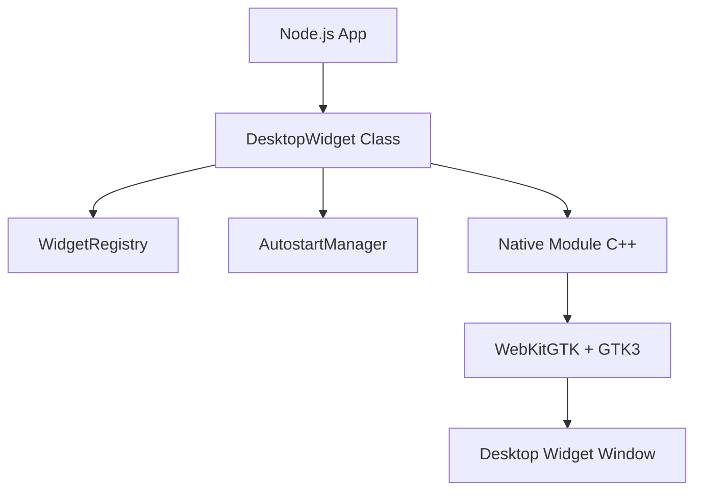

# WidgetCore 🐧

**WidgetCore** is a high-performance, Linux-only library built with Node.js and C++ for creating interactive and persistent desktop widgets. It leverages **WebKitGTK** to provide a seamless, lightweight, and hardware-accelerated widget experience across all major Linux distributions and desktop environments.

---

## 🏗️ Architecture Overview

WidgetCore uses a hybrid architecture where the core logic is managed in Node.js, while windowing and webview rendering are handled by a native C++ module using GTK3 and WebKitGTK.



---

## ✨ Core Capabilities

- **🚀 HTML/JS Power**: Build widgets using any web technology. No restricted environments.
- **🖼️ Native Transparency**: Aggressive transparency settings ensure widgets blend perfectly with wallpapers.
- **🖇️ System Integration**: Supports both X11 (via EWMH) and Wayland (via `gtk-layer-shell`).
- **🖱️ Full Interactivity**: Toggle `interactive: true` to allow mouse clicks and keyboard input directly on the desktop background.
- **💾 Auto-Persistence**: Automatically saves widget state and ensures they reappear after system reboots.
- **🧩 Scroll-Free Design**: Scrollbars are hidden by default via CSS injection.

---

## 🔒 Security Shield

Security is a primary concern for widgets. **WidgetCore** implements a multi-layer "Shield" to protect the host system:

1. **API Isolation**: Injects a preload script that freezes `process`, `require`, and other sensitive Node.js globals.
2. **Context Separation**: The webview runs in a sandboxed environment.
3. **Protocol Filtering**: Only `http:`, `https:`, and valid `file:` protocols are allowed.
4. **Keyword Blocking**: Logic scans for dangerous keywords like `shell`, `eval`, or `exec`.

---

## 🚀 Detailed Usage

### Advanced HTML Widget Example

```typescript
import { DesktopWidget } from '@osmn-byhn/widget-core';

const clockHTML = `
  <div id="clock" style="font-size: 48px; font-weight: bold; color: #60A5FA; font-family: sans-serif; text-shadow: 2px 2px 10px rgba(0,0,0,0.5);">00:00:00</div>
  <script>
    setInterval(() => {
      document.getElementById('clock').innerText = new Date().toLocaleTimeString();
    }, 1000);
  </script>
`;

const widget = new DesktopWidget("", {
  html: clockHTML,
  width: 300,
  height: 100,
  x: 50,
  y: 50,
  scroll: false,
  interactive: false
});

// Make it stay after reboot
await widget.makePersistent(widget.options);
```

---

## 🛠️ API Documentation

### `WidgetOptions`

| Property | Type | Description |
| :--- | :--- | :--- |
| `width` | `number` | Width in pixels. |
| `height` | `number` | Height in pixels. |
| `x` | `number` | X coordinate from top-left. |
| `y` | `number` | Y coordinate from top-left. |
| `opacity` | `number` | Window opacity (0.0 to 1.0). Default: `1.0`. |
| `interactive` | `boolean` | If `true`, clicks pass through to the widget. Default: `false`. |
| `html` | `string` | Raw HTML/CSS source code to load. |
| `scroll` | `boolean` | If `false`, `overflow: hidden` is applied. Default: `true`. |
| `blur` | `boolean` | Backdrop blur effect (WebKit implementation). |

---

## 🐧 Linux Installation & Dependencies

WidgetCore is designed to work on all major distributions (Debian, Arch, RedHat, etc.) and desktop environments (GNOME, KDE, LXQt, etc.).

### System Dependencies

#### Debian / Ubuntu / Mint

```bash
sudo apt install libwebkit2gtk-4.0-dev libgtk-3-dev libgtk-layer-shell-dev
```

#### Arch Linux / EndeavourOS / Manjaro

```bash
sudo pacman -S webkit2gtk gtk3 gtk-layer-shell
```

#### Fedora / RedHat / CentOS

```bash
sudo dnf install webkit2gtk4.0-devel gtk3-devel gtk-layer-shell-devel
```

### Environment Notes

- **Wayland**: Fully supported via `gtk-layer-shell`.
- **X11**: Supported via EWMH `_NET_WM_STATE_BELOW` protocols.
- **Autostart**: Uses standard `.desktop` files in `~/.config/autostart/`.

---

## 🧪 Development

```bash
npm install
npm run build
npm test
```


---

## 📝 License
MIT License. Copyright (c) 2026 Osman Beyhan.
